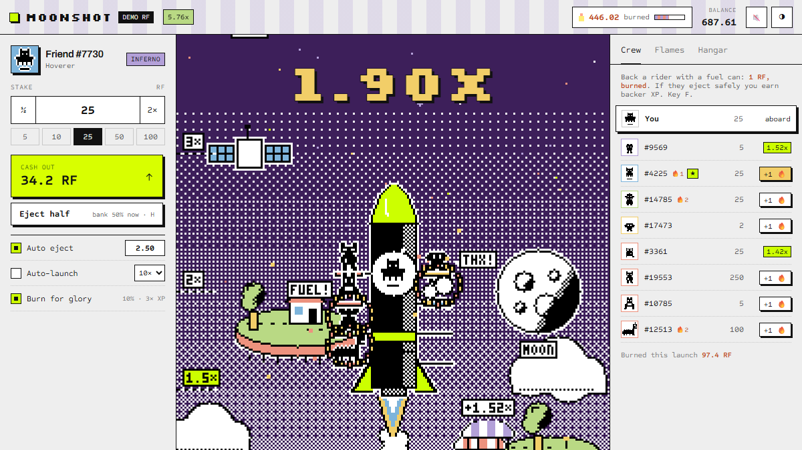
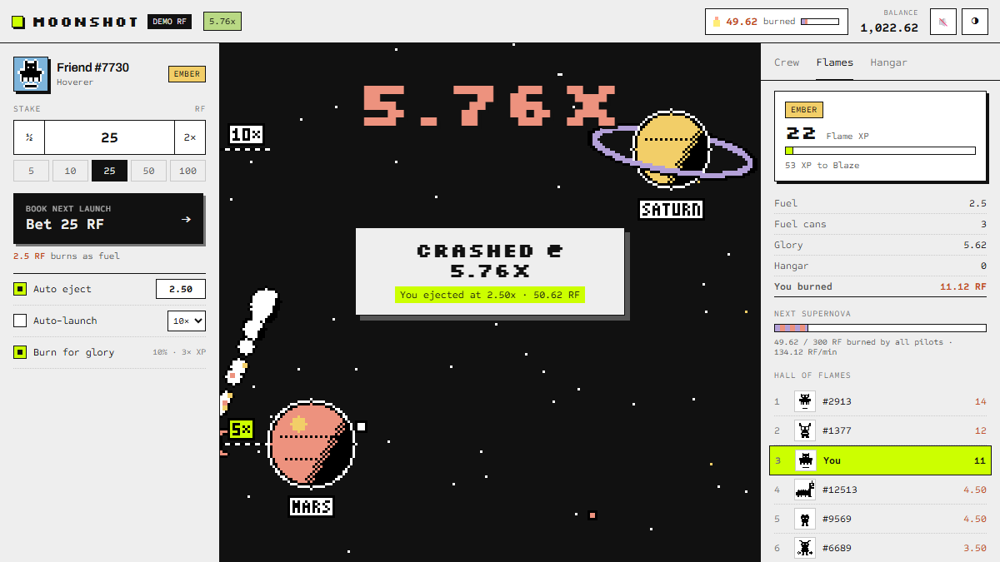

# Moonshot 🚀

**A live crash game for the Rare Friends Vibeathon (Token Activity).** Your Rare Friend pilots the rocket, a crew of real Generations Friends hitch a ride, and RF burns on every launch: **10% fuel** (20% on Supernova launches), plus **fuel cans**, **Burn for glory** and the **Hangar**. Built with FriendSDK **v0.1.2**.


🎮 **Play:** https://bbczzzs.github.io/moonshot/ requires a browser wallet on Robinhood mainnet (4663) holding a hardwired Rare Friends Generations NFT (gen ≥ 1). This is the SDK's standard gate, the same as every SDK entry. All balances are **simulated demo RF**.

👀 **No wallet? Preview page:** https://bbczzzs.github.io/moonshot/preview/ (GIF, video, screens, burn rules and the verified math)

🎬 [Full-quality recording (MP4)](media/moonshot-demo.mp4)

| Liftoff | Flight: cans + eject half | Supernova launch | Flames tab + missions |
|---|---|---|---|
|  |  |  |  |

## In one minute

- **New launch every ~15 s.** Board during a 6-second window, ride the multiplier, eject before it crashes.
- **Every launch burns 10% of every stake as fuel.** That's the whole house edge; the house keeps nothing. Ejecting at any target returns exactly 90% on average (`P(crash ≥ m) = 1/m`).
- **Crashes feed the Launch Pool**, which pays everyone who ejected.
- **Fuel cans:** throw 1 RF (**burned 100%**) at any rider mid-flight. They get a flame aura, and the crowd throws cans too. Back a rider who ejects safely and you earn backer XP.
- **Supernova launches:** every 300 RF burned by all pilots, the next launch burns **20% fuel**, turns the sky purple and pays **3× Flame XP**.
- **Eject half:** bank 50% of your ride and let the rest fly. Same fair odds, real strategy.
- **Missions:** five session goals that pay Flame XP and unlock an exclusive skin.
- **Real RF supply:** one on-demand read of the live `totalSupply()` to show the burn as a share of the real supply.
- **Burn for glory:** optionally burn 10% of every payout for 3× XP.
- **Hangar:** rocket skins and exhaust trails, **100% burned**, cosmetic only.
- **Flame rank + Hall of Flames:** Spark → Ember → Blaze → Inferno → Supernova, plus a burn leaderboard.
- **Auto eject + auto-launch** keep the spend loop running hands-free.
- **Rare Friends house style.** Drawn in the FriendSDK game palette with ink outlines and dither shading, on a floating meadow island, with the SDK frame's paper-and-ink UI.
- **Real Friends everywhere.** Your pilot is read live with the SDK sprite reader, and the crew are real Generations Friends' on-chain sprites.

**Burn projection (illustrative, not measured).** Assumptions: each player averages 40 launches a day at 10 RF, 10% of launches are Supernovas, players throw a fuel can every other launch, and 30% of players use Burn for glory. Hangar purchases are excluded. Per launch that's 1.10 RF fuel + 0.50 RF cans + 0.27 RF glory = **1.87 RF burned per 10 RF staked (≈18.7% of volume)**, or about **75 RF per player per day**.

| Daily players | RF burned / day | RF burned / year |
|---|---|---|
| 50 | 3,740 | ≈1.4M |
| 500 | 37,400 | ≈13.7M |
| 5,000 | 374,000 | ≈137M |

Live, the Supernova threshold (300 RF in the preview) would scale with volume to keep Supernovas near 10% of launches.

Full rules, math, checks and known issues: [`games/moonshot/README.md`](games/moonshot/README.md).

## Repository layout

- `index.html`, `game.*`, `runtime.*`, `assets/`: the built static preview served by GitHub Pages
- `games/moonshot/`: game source (`index.tsx` UI and round loop, `economy.ts` math and ledger, `scene.ts` pixel-art renderer, `crew.ts`, `looks.ts`, `audio.ts`, `pilot.ts`)
- `verify-sdk-math.mjs`: 500,000-launch economy verification
- `test-interaction.mjs`: browser interaction test in the SDK runtime (mock wallet)
- `media/`: GIF, MP4 and screenshots
- `GAME_DESIGN.md`: the original v1 design doc (superseded by the game README)

## Develop

```sh
npm install
npx friendsdk dev games/moonshot                    # local preview (real wallet gate)
npx friendsdk build games/moonshot --outdir dist    # static build
npm run typecheck                                   # strict TypeScript
node verify-sdk-math.mjs                            # economy check
node test-interaction.mjs 960                       # interaction test (needs: npx playwright install chromium)
```

## Credits

All art drawn in code, all audio synthesized (WebAudio). Friend sprites are canonical Rare Friends Generations artwork via FriendSDK. Fonts: Silkscreen, Sometype Mono and Archivo (all SIL OFL, bundled).
