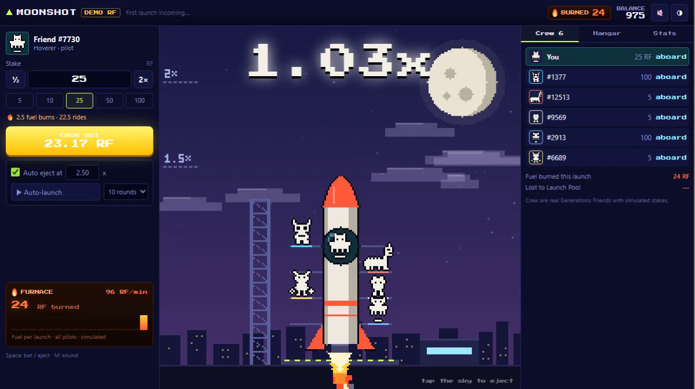
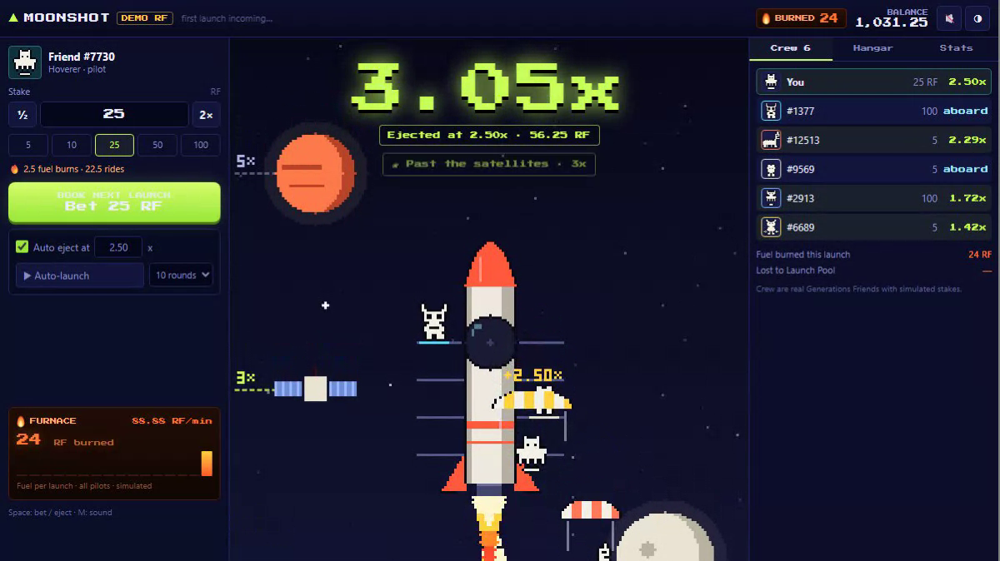
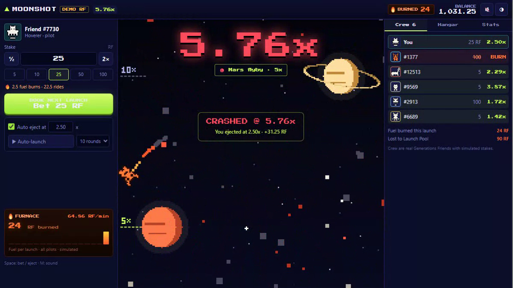
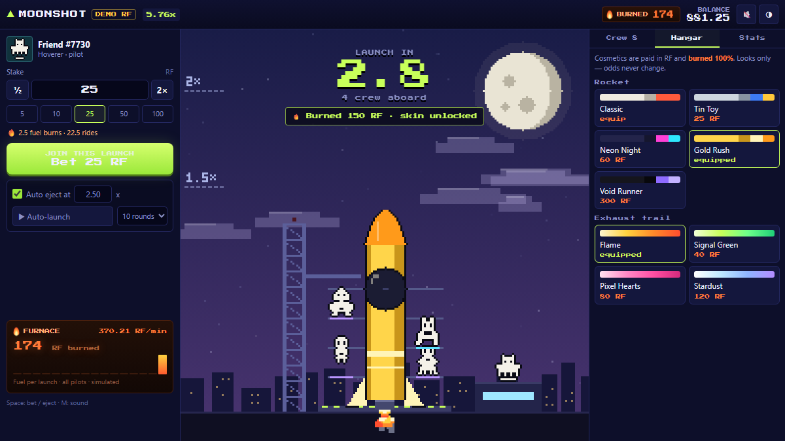

# Moonshot 🚀

**A live crash game for the Rare Friends Vibeathon (Token Activity).** Your Rare Friend pilots the rocket, a crew of real Generations Friends hitch a ride, and **10% of every stake burns as rocket fuel**, win or lose. Built with FriendSDK **v0.1.2**.


🎮 **Play:** https://bbczzzs.github.io/moonshot/ requires a browser wallet on Robinhood mainnet (4663) holding a hardwired Rare Friends Generations NFT (gen ≥ 1). This is the SDK's standard gate, the same as every SDK entry. All balances are **simulated demo RF**.

🎬 [Full-quality recording (MP4)](media/moonshot-demo.mp4)

| Liftoff | Flight | Crash | Hangar |
|---|---|---|---|
|  |  |  |  |

## In one minute

- **New launch every ~15 s.** Board during a 6-second window, ride the multiplier, eject before it crashes.
- **Every launch burns 10% of every stake as fuel.** That's the whole house edge; the house keeps nothing. Ejecting at any target returns exactly 90% on average (`P(crash ≥ m) = 1/m`).
- **Crashes feed the Launch Pool**, which pays everyone who ejected.
- **Hangar:** rocket skins and exhaust trails, **100% burned**, cosmetic only.
- **Auto eject + auto-launch** keep the spend loop running hands-free. A furnace meter tracks RF burned per minute.
- **Real Friends everywhere.** Your pilot is read live with the SDK sprite reader, and the crew are real Generations Friends' on-chain sprites.

Full rules, math, checks and known issues: [`games/moonshot/README.md`](games/moonshot/README.md).

## Repository layout

- `index.html`, `game.*`, `runtime.*`, `assets/`: the built static preview served by GitHub Pages
- `games/moonshot/`: game source (`index.tsx` UI and round loop, `economy.ts` math and ledger, `scene.ts` pixel-art renderer, `crew.ts`, `looks.ts`, `audio.ts`, `pilot.ts`)
- `verify-sdk-math.mjs`: 500,000-launch economy verification
- `test-interaction.mjs`: browser interaction test in the SDK runtime (mock wallet)
- `media/`: GIF, MP4 and screenshots
- `GAME_DESIGN.md`: the original v1 design doc (superseded by the game README)

## Develop

```sh
npm install
npx friendsdk dev games/moonshot                    # local preview (real wallet gate)
npx friendsdk build games/moonshot --outdir dist    # static build
node verify-sdk-math.mjs                            # economy check
node test-interaction.mjs 960                       # interaction test (needs: npx playwright install chromium)
```

## Credits

All art drawn in code, all audio synthesized (WebAudio). Friend sprites are canonical Rare Friends Generations artwork via FriendSDK. Pixel font: Press Start 2P (OFL).
