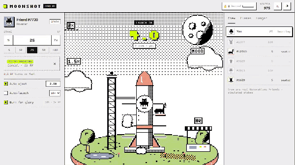

# Moonshot 🚀

**A live crash game where your Rare Friend pilots the rocket, a crew of real Generations Friends hitch a ride, and every launch burns RF.**

Built with FriendSDK **v0.1.2** for the Rare Friends Vibeathon · Category: **Token Activity**

## How it plays

A new launch every ~15 seconds:

1. **Boarding (6 s).** Crew Friends hop onto the rocket's outrigger seats. Tap **Join this launch** (or press Space) to put your stake in. Your Friend climbs into the cockpit dome. Cancel any time before liftoff for a full refund.
2. **Liftoff.** **10% of every stake burns as rocket fuel**, from every pilot and win or lose. The multiplier climbs from 1.00x as `m(t) = e^(0.12t)`: 2x at ~5.8 s, 10x at ~19 s.
3. **Eject.** Hit **Cash out** (Space, or tap the sky) to eject with a parachute and collect `ride × multiplier`. Crew Friends eject at their own targets, and you'll see them float down with the multiplier they got out at.
4. **Crash.** Whoever is still aboard burns with the rocket. Their ride goes to the Launch Pool, which funds everyone who ejected.

Landmarks sit at the altitude of their multiplier, so you pass the **Moon at 2x**, satellites at 3x, **Mars at 5x**, **Saturn at 10x**, then a nebula (25x), a black hole (50x) and a galaxy (100x). An altitude ruler marks 1.5x through 1000x.

**Auto eject** sets a target multiplier. **Auto-launch** re-enters for 5, 10, 25 or 50 rounds, or indefinitely, and stops when the demo balance runs out.

## Look and feel

Moonshot is drawn in the Rare Friends world style and uses the FriendSDK game palette (meadow `#B9D984`, pond `#7DB4DB`, sun `#F2CE68`, coral `#ED927E`, lilac `#B3A0D8`, signal `#CCFF00`) with black ink outlines and checker-dither shading. Friends stay canonical black and white. The launch site is a floating meadow island, like the SDK's own worlds. As the rocket climbs, the sky dithers from white paper into black space. The UI follows the SDK frame: `#eee` paper, `#111` ink, square corners, 1px rules, hard offset shadows, with Silkscreen, Sometype Mono and Archivo type.

## RF costs, probabilities and rewards

Everything is **simulated demo RF** (1,000 to start) and labelled as such in the UI. No real funds move.

| | Rule |
|---|---|
| Stake | Any amount ≥ 1 RF (presets 5 / 10 / 25 / 50 / 100, ½ and 2×) |
| Fuel burn | **10% of every stake, burned at liftoff**, whatever the outcome |
| Ride | The other 90% rides the rocket |
| Crash point | `U ~ Uniform[0,1)`, `C = floor(100 / (1 − U)) / 100`. C is the highest multiplier reached |
| Win chance | `P(C ≥ m) = 1/m` for any two-decimal target m ≥ 1.01. About 1% of launches bust at 1.00x |
| Eject payout | `ride × m`, so the expected return at any fixed target is **exactly 90% of stake** |
| House edge | **10%, and all of it is burned.** The house keeps nothing |
| Crash | Riders still aboard lose their ride to the Launch Pool, which pays ejectors (zero-sum in expectation) |
| Hangar | 5 rocket skins (free to 300 RF) and 4 exhaust trails (free to 120 RF). **100% burned** on purchase, cosmetic only |

**Why Token Activity:** every launch is a spend event for every pilot, and every launch is a burn event (fuel). Hangar purchases are a second pure burn sink with no prize liability. The loop repeats about every 15 seconds, and auto-launch keeps it going hands-free. The top bar keeps a session burn counter, and the **Furnace** card shows RF burned per minute and fuel per launch.

**The crew** are real Rare Friends Generations NFTs. Their canonical on-chain sprites were read from the artwork registry and baked into `crew-sprites.json`. Their stakes and eject targets are simulated for the preview; at launch these seats would be real players. Your own pilot is read live through the SDK's `createFriendReader()`.

## Run it

- Node.js 22+
- `npm install`
- `npx friendsdk dev games/moonshot`: local preview. It needs a browser wallet on **Robinhood mainnet (4663)** holding a hardwired Generations NFT (gen ≥ 1), which is the SDK's standard gate.
- `npx friendsdk build games/moonshot --outdir dist`: static build for any HTTPS host.

Controls: **Space** bets, cancels or ejects. **M** toggles sound. Everything also has a button for touch. Sound is off by default. Reduced motion follows the system setting and has its own toggle. The runtime's pause (menus open) freezes the flight without forfeiting anything.

## Checks

- `node verify-sdk-math.mjs`: 500,000 simulated launches. Instant bust 1.00%. Return 89.97% / 90.08% / 89.99% / 89.68% at 1.5x / 2x / 5x / 10x targets. Fuel burn 10.00% of volume. Launch Pool in/out balanced. Ledger and hangar arithmetic asserted.
- `node test-interaction.mjs 960` and `node test-interaction.mjs 390`: in the real sandboxed runtime with the SDK's mock wallet, covering joining during boarding, liftoff, pausing mid-flight (the multiplier freezes), resuming, ejecting (or a valid crash), crash history, a hangar purchase that burns exactly 25 RF, auto-launch booking the next boarding, and the sound toggle. **PASS** at both widths, no browser errors.
- `npx friendsdk check games/moonshot`: valid. `npx friendsdk test games/moonshot --width 1200` and `--width 360`: **PASS**.

## Known issues

- A real-wallet playthrough of this version on the public preview is still to be confirmed by the builder.
- Crew behaviour (stakes, targets) is simulated; the SDK has no multiplayer yet.
- `game.json` carries the placeholder chance-game definition the runtime schema requires. Moonshot runs its own documented ledger (`economy.ts`) and does not use the chance-game actions. Going live needs a round contract: a `burn()` of the fuel, a pool that escrows rides and pays ejectors, and a verifiable crash-point seed (Dice/VRF) committed before boarding closes.
- Balances, owned cosmetics and history reset on reload (the SDK sandbox has no storage).
- If the pilot's artwork can't be read (slow RPC), a deterministic stand-in sprite is shown and labelled "art offline".
- The GIF and screenshots were recorded from a local harness that mounts the same game component, so the wallet screen isn't shown. Automated tests use the SDK's mock wallet.

## Credits

All scenery, the rocket, planets, particles and UI are drawn in code. All audio is synthesized with WebAudio. Friend sprites are canonical Rare Friends Generations artwork (FriendSDK sprite reader / on-chain registry, see the SDK `NOTICE.md`). Fonts: Silkscreen, Sometype Mono and Archivo (all SIL OFL, bundled).
